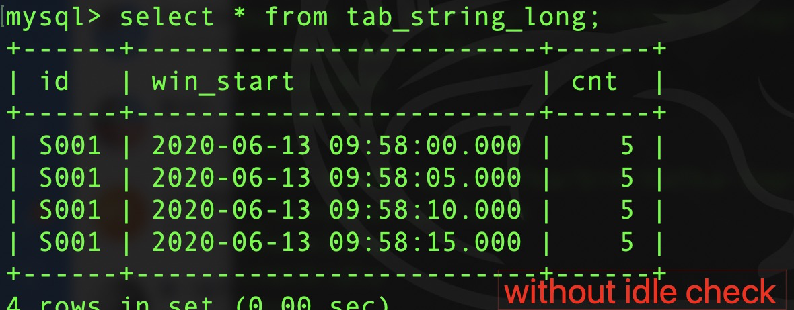
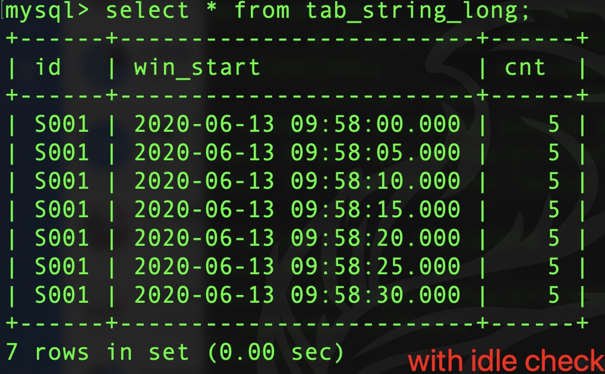

使用说明：
这部分代码是为了解决 Kafka 多个分区时候，如果有某一个分区没有数据（数据少）导致计算问题。比如我们有一个Kafka的Topic，有
2个分区，如下数据：
```
S001,1, 2020-06-13 09:58:00
S001,1, 2020-06-13 09:58:01
S001,2, 2020-06-13 09:58:02
S001,3, 2020-06-13 09:58:03
S001,4, 2020-06-13 09:58:04
S001,5, 2020-06-13 09:58:05
S001,6, 2020-06-13 09:58:06
S001,7, 2020-06-13 09:58:07
S001,8, 2020-06-13 09:58:08
S001,9, 2020-06-13 09:58:09
S001,10, 2020-06-13 09:58:10
S001,11, 2020-06-13 09:58:11
S001,12, 2020-06-13 09:58:12
S001,13, 2020-06-13 09:58:13
S001,14, 2020-06-13 09:58:14
S001,15, 2020-06-13 09:58:15
S001,16, 2020-06-13 09:58:16
S001,17, 2020-06-13 09:58:17
S001,18, 2020-06-13 09:58:18
S001,19, 2020-06-13 09:58:19
S001,20, 2020-06-13 09:58:20
S001,21, 2020-06-13 09:58:21 // 这条数据在第一个分区，其他数据在第二个分区。
S001,22, 2020-06-13 09:58:22
S001,23, 2020-06-13 09:58:23
S001,24, 2020-06-13 09:58:24
S001,25, 2020-06-13 09:58:25
S001,26, 2020-06-13 09:58:26
S001,27, 2020-06-13 09:58:27
S001,28, 2020-06-13 09:58:28
S001,29, 2020-06-13 09:58:29
S001,30, 2020-06-13 09:58:30
S001,31, 2020-06-13 09:58:31
S001,32, 2020-06-13 09:58:32
S001,33, 2020-06-13 09:58:33
S001,34, 2020-06-13 09:58:34
S001,35, 2020-06-13 09:58:35
S001,36, 2020-06-13 09:58:36
S001,37, 2020-06-13 09:58:37
S001,38, 2020-06-13 09:58:38
S001,39, 2020-06-13 09:58:39
```

我们利用自定义Partitioner的方式，让第21条数据到第一个分区，其他的在第二个分区。这时候，如果业务需求是一个5秒钟的窗口。
那么，目前Flink-1.10默认只能触发4个窗口计算，也就是从22条数据到39条数据都不会触发计算了。利用本篇提及的解决方案可以完成
7个窗口的触发（全部窗口）。

* Flink-1.10 默认行为(without idle check)



* 本方案行为(with idle check)



1. 如果你还没有docker，请参考：https://www.docker.com/get-started
2. 当你完成docker环境之后，本示例需要按照Kafka
  a) 安装kafka镜像
  `docker pull wurstmeister/kafka`
  
  b)安装zookeeper镜像
  `docker pull wurstmeister/zookeeper`
  
  c)运行zookeeper容器
  `docker run -d --name zookeeper  -p 2181:2181 -t wurstmeister/zookeeper`
  
  d)运行kafka容器
  ```
    docker run -d --name kafka --publish 9092:9092 \
    --link zookeeper \
    --env KAFKA_ZOOKEEPER_CONNECT=zookeeper:2181 \
    --env KAFKA_ADVERTISED_HOST_NAME=127.0.0.1 \
    --env KAFKA_ADVERTISED_PORT=9092 \
    wurstmeister/kafka
   ```

3. 环境安装完成，发送/接受消息测试
   
   a) 进入命令行
   `docker exec -it kafka /bin/bash`
   
   b) 查看现有Topic
   `/opt/kafka/bin/kafka-topics.sh --zookeeper zookeeper:2181 --list`
   
   c) 如果没有你需要的，创建一个,2个分区
   ```
   /opt/kafka/bin/kafka-topics.sh --zookeeper zookeeper:2181 --create --topic checkIdle --partitions 2 --replication-factor 1
   ```
   
4. MySQL 5.7 环境和结果表

 a) 安装
`docker pull mysql:5.7`

 b) 运行MySQL
 `docker run -p 3306:3306 --name flink_mysql -e MYSQL_ROOT_PASSWORD=123456 -d mysql:5.7`
 
 c) 连接
 `docker exec -it flink_mysql bash` 
 `mysql -h localhost -u root -p`
 
 d) 创建数据库和表
 ```
create database flink_db;
use flink_db;

CREATE TABLE tab_string_long( id VARCHAR(20), win_start TIMESTAMP(3), cnt BIGINT,  PRIMARY KEY ( id, win_start ));
```

5. 生产数据

a) ProducerTestData 会向topic2个partition中谢数据，其中first partition数据很少，进而造成idle的
问题。

b) 运行 DiscoverIdlePartition(for datastream), DiscoverIdlePartitionInFlinkSQL(for SQL flink planner)，消费数据并且定义5秒钟的tumble窗口。

6. 如果你上面的步骤没有成功，注意关注我《Apache Flink知其然，知其所以然》视频课程，里面会有视频演示。


