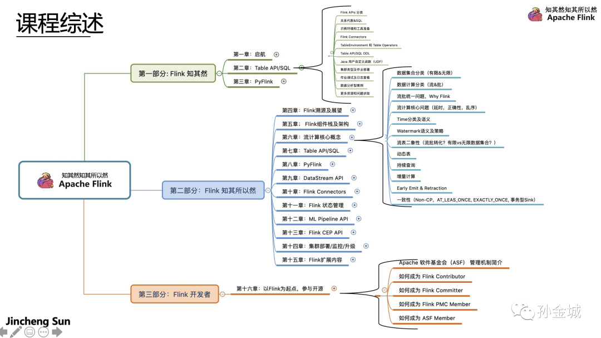
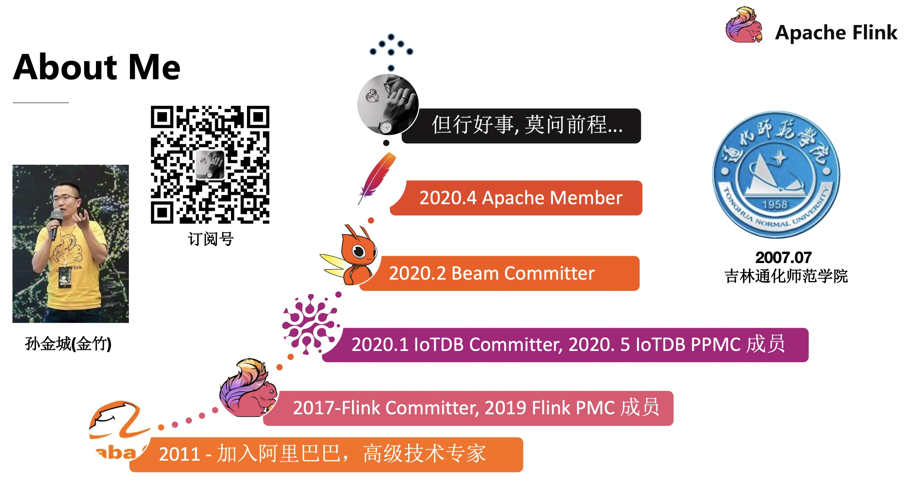

# 项目简介
本项目会覆盖公众号【孙金城】中的文章和《Apache Flink 知其然，知其所以然》视频课程的所有示例代码。特别说明，示例代码仅用于原理和API使用的说明，由于某些知识点是局部的，示例代码不会全盘考虑，进而所有示例代码不保证达到投产的质量。

# 课程综述

《Apache Flink 知其然，知其所以然》课程，在内容上会先对Flink整体架构和所适用的场景做一个基础介绍，让你对Flink有一个整体的认识！然后对核心概念进行详细介绍，让你深入了解流计算中一些核心术语的含义，然后对Flink 各个层面的API，如 SQL/Table&DataStreamAPI/PythonAPI 进行详细的介绍,以及底层的实现原理进行剖析和具体场景的最佳实践分析，让你对Flink所提供的功能做到 知其然，知其所以然。整体课程的三个部分定位如下：

 - Flink知其然 - 注重Flink的使用，面向初级人群；

 - Flink知其所以然 -  注重原理分析和生产经验分享，面向高级进阶人群；

 - Flink开发者 - 重点为大家分享作者在社区的开发经验，意在辅助大家更好的参与社区开发；

本课程将会让一线开发能具备使用Apache Flink进行线上业务快速开发的能力，帮助架构师或者团队Team leader和Tech lead对实际工作中构建流计算平台做更好的技术选型决策和规划。

# 关于作者
孙金城（金竹），2011年加入阿里，9年的阿里工作中，主导过很多内部核心系统，如，阿里集团行为日志，阿里郎，云转码，文档转换等云服务！在2016年初开始了解Apache Flink社区，由初期的参与社区开发到后来逐渐主导具体模块的开发，到负责Apache Flink Python API(PyFlink) 的建设。 目前是 阿里巴巴 Tech Lead，ASF Member，PMC Member of Apache Flink and Apache IoTDB 以及 Committer for Apache Flink, Apache Beam and Apache IoTDB 。

**我坚信:** 才，德之资也，德，才之帅也！

