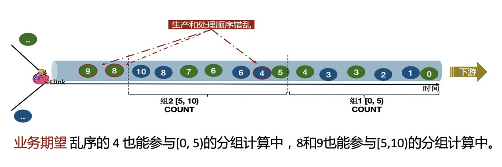

# 乱序问题

如图，我们期望利用Watermark机制，解决事件4和事件8/9的乱序问题。

# 测试步骤
1. 首先我们让Watermark=Eventtime，这样乱序的4和8/9会被丢弃。
   - (key,13000)
   - (key,32000)
   - (key,10000)
2. 然后我们让Watermark=Eventtime-3秒，这样4和8/9也会落到正确的窗口计算。
   - (key,17000)
   - (key,49000)
   - (key,10000)